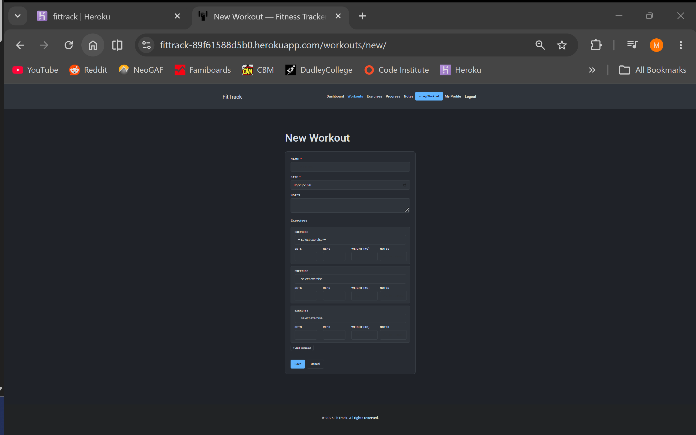
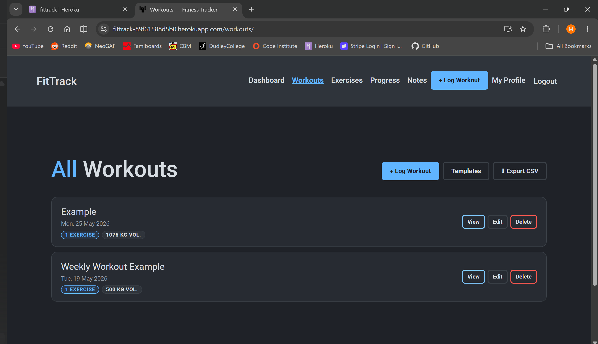
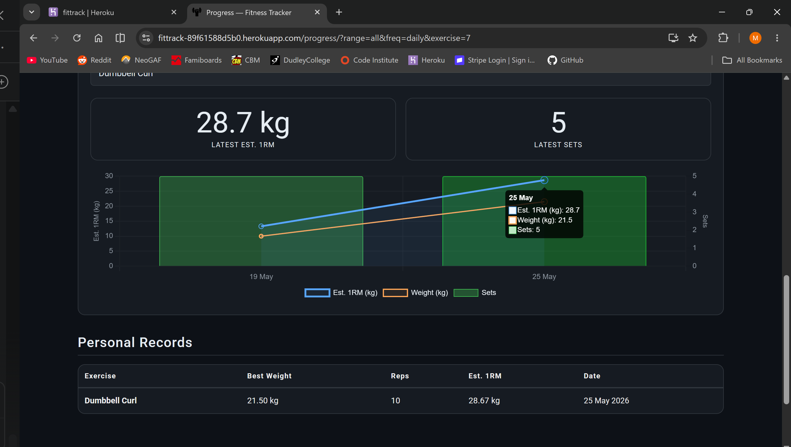
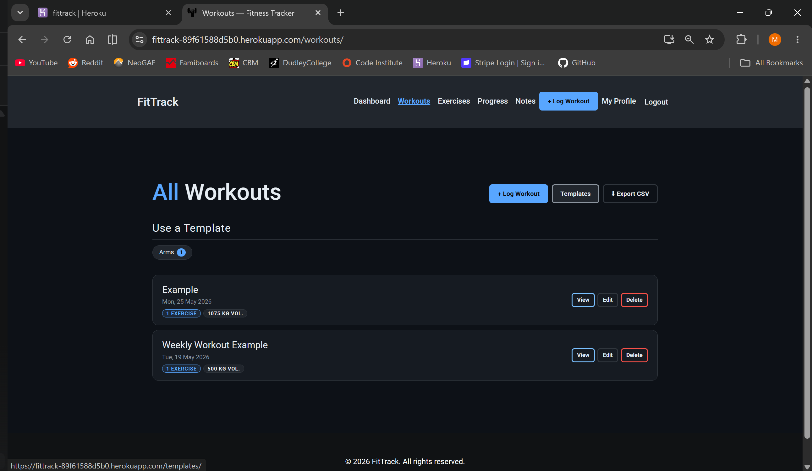
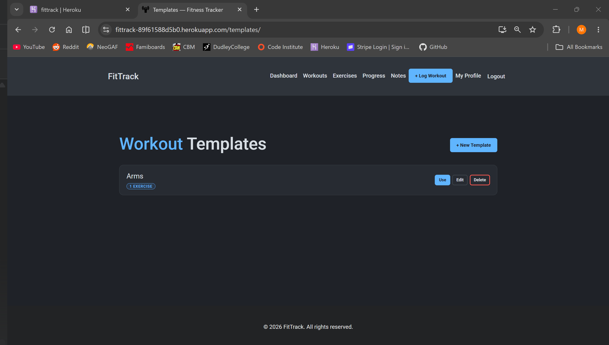
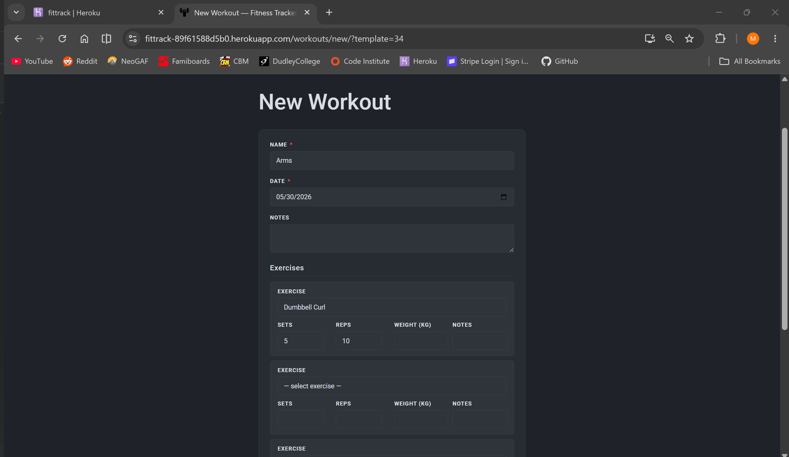
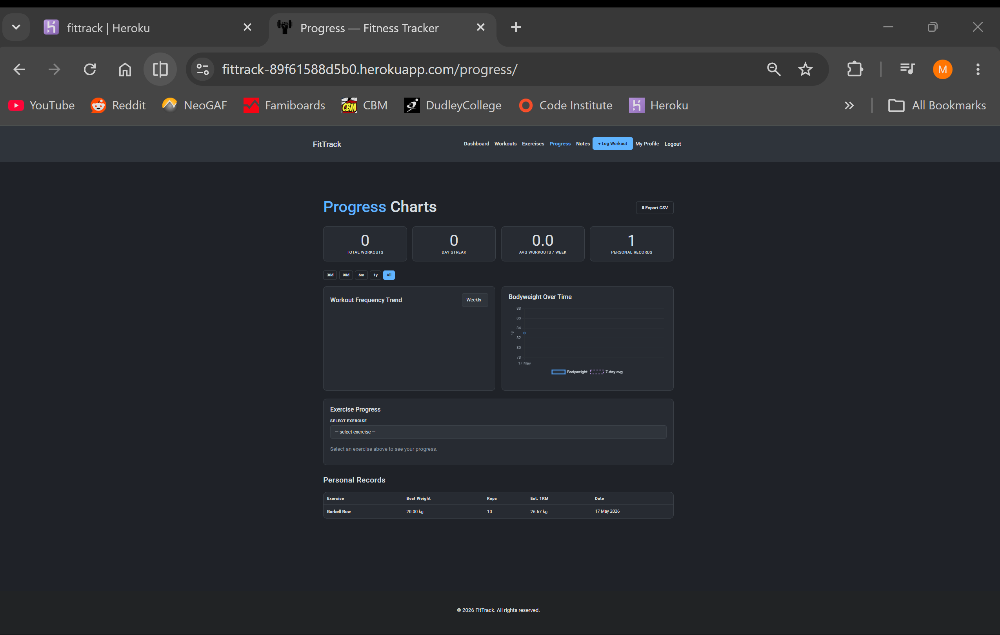
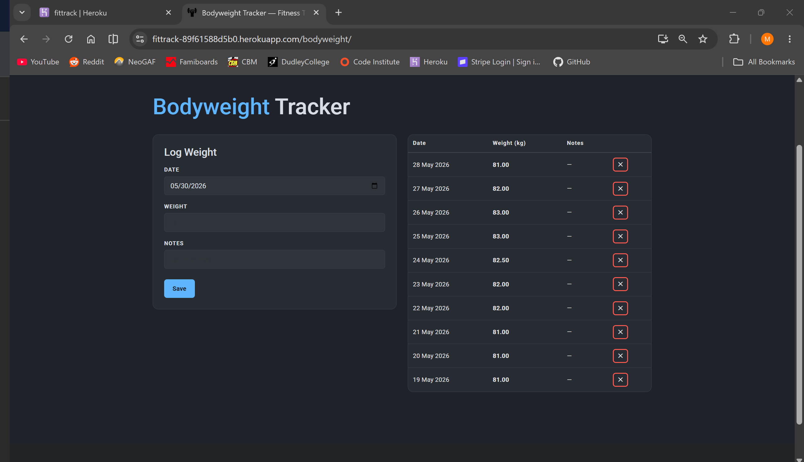
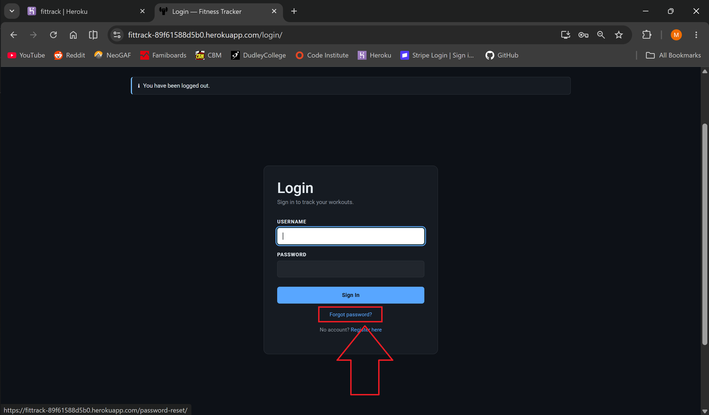
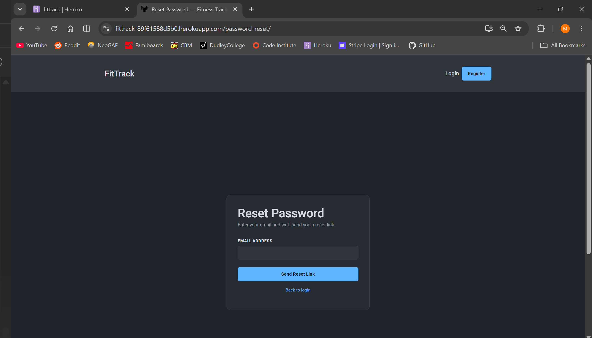

# FitTrack — Full Stack Fitness Tracker


A full-stack web application designed to help gym-goers log workouts, track exercise progress, and analyse their training data over time. The application is built with Django and PostgreSQL and uses Chart.js for interactive progress visualisations.

## Table of Contents

- [Project Overview](#project-overview)
- [Purpose & Value](#purpose--value)
  - [Target Audiences & Their Needs](#target-audiences--their-needs)
  - [Value to the User](#value-to-the-user)
- [User Experience (UX)](#user-experience-ux)
  - [Strategy](#strategy)
  - [Design Rationale](#design-rationale)
  - [Accessibility Considerations](#accessibility-considerations)
- [User Stories](#user-stories)
- [Skeleton](#skeleton)
- [Screenshots](#screenshots)
- [Features](#features)
  - [Workout Logging](#workout-logging)
  - [Progress & Analytics](#progress--analytics)
  - [Workout Templates](#workout-templates)
  - [Body & Wellbeing](#body--wellbeing)
  - [Exercise Library](#exercise-library)
  - [User Account](#user-account)
  - [Progressive Web App](#progressive-web-app)
- [Technology Stack](#technology-stack)
- [Getting Started](#getting-started)
- [Deployment](#deployment)
- [Data Schema](#data-schema)
- [Security Features](#security-features)
- [Accessibility](#accessibility)
- [Validation](#validation)
  - [Python / Django](#python--django)
  - [HTML5](#html5)
  - [CSS3](#css3)
  - [JavaScript](#javascript)
- [Testing Documentation](#testing-documentation)
  - [Overview](#overview)
  - [Testing Methodology](#testing-methodology)
    - [Manual Testing](#manual-testing)
    - [Automated Testing](#automated-testing)
  - [User Story Verification](#user-story-verification)
  - [Functionality Testing](#functionality-testing)
  - [Usability & Accessibility Testing](#usability--accessibility-testing)
  - [Responsiveness Testing](#responsiveness-testing)
  - [WCAG 2.1 AA Compliance](#wcag-21-aa-compliance)
  - [Development vs. Deployment Verification](#development-vs-deployment-verification)
  - [Known Bugs & Resolutions](#known-bugs--resolutions)
- [Future Improvements](#future-improvements)
- [Project Structure](#project-structure)
- [Sources](#sources)
  - [Libraries & Frameworks](#libraries--frameworks-1)
  - [Deployment & Services](#deployment--services)
  - [References](#references)
  - [Images](#images)

---

## Project Overview

FitTrack is a full-stack web application that empowers users to systematically log, track, and review their gym workouts. Unlike mobile-only solutions or complex spreadsheet alternatives, FitTrack provides a dedicated web-based interface optimised for both desktop and mobile use, requiring no app installation or subscription fees.

Key focal points:
- Streamlined workout logging with inline exercise entry — all exercises logged on a single page using an inline formset
- Progress charts: workout frequency (area chart with EMA trend), bodyweight trend with Exponential Moving Average, and per-exercise estimated 1RM and actual weight
- Personal records board with automatic PR detection on every workout save
- Workout templates for quickly starting a session from a saved routine
- Bodyweight tracker and daily notes with mood tracking
- CSV export of full workout history
- Email-based password reset flow
- Progressive Web App (PWA) — installable on Android and iOS via "Add to Home Screen"
- Arctic Blue dark theme — fully custom CSS with no framework dependency
- Secure per-user data isolation with object-level access control

---

## Purpose & Value

FitTrack addresses a critical pain point for fitness enthusiasts: the need for a simple, fast, and reliable way to track workout progress without relying on expensive mobile apps or generic spreadsheets. The application combines the structure of a proper relational database with the accessibility of a web browser, enabling users to focus on their fitness goals rather than struggling with complex interfaces.

### Target Audiences & Their Needs

The application is specifically designed to cater to three distinct types of users:

1. **Serious Gym Enthusiasts & Strength Athletes**: Users who prioritise detailed workout logging, progressive overload tracking, and data-driven fitness decisions. They need precise recording of sets, reps, and weight, and want to see their estimated 1RM trend over time to verify strength is improving.

2. **Casual Fitness Trackers & Beginners**: Individuals new to gym training who want a simple, no-frills tool to build a habit of logging workouts without being overwhelmed by complex interfaces or unnecessary features.

3. **Mobile-First Athletes & On-the-Go Trainers**: Users who train at multiple locations and need quick access to their workout history via any internet-connected device — mobile phone, tablet, or desktop. They require fast load times and a responsive layout that works without an app installation.

### Value to the User

The site provides tangible value to these audiences across four key dimensions:

- **Accountability Through History**: By providing a persistent, searchable workout log, users gain an unambiguous record of their training. This creates accountability and reveals patterns — for example, noticing that a particular muscle group hasn't been trained in several weeks.

- **Progress Visualisation**: The progress page delivers three distinct chart types: an area chart for training frequency (daily/weekly/monthly) with an EMA trend overlay and configurable target line; a line chart with Exponential Moving Average for bodyweight; and a mixed chart showing both estimated 1RM and actual weight lifted per exercise. This allows users to see trends that raw numbers cannot convey.

- **Automatic PR Detection**: Personal records are detected and stored automatically whenever a workout entry is saved. The PR board on the progress page and dashboard shows best weight, reps, and estimated 1RM per exercise — without any manual input from the user.

- **Workout Templates**: Users can save named workout structures (e.g., "Push Day", "Leg Day") and launch a new session pre-filled with those exercises in a single click. This eliminates repetitive data entry for users following structured training programmes.

- **Data Privacy & Ownership**: Unlike fitness social networks, FitTrack stores user data in a secure, password-protected account. All data is scoped to the logged-in user and is never shared or sold.

---

## User Experience (UX)

### Strategy

The target users for this project include:
- Regular gym-goers who want to build an objective training record
- Users looking for a lightweight, web-based alternative to mobile apps
- Athletes following structured programmes who need quick session logging
- Users who track body composition alongside strength progress

The site aims to deliver quick workout logging via a minimal, distraction-free interface with all key actions reachable within two clicks from the dashboard.

### Design Rationale

**Purpose & Audience:**
FitTrack addresses the needs of gym users who require a fast, reliable logging tool without the complexity of enterprise fitness platforms. The design focuses on reducing friction by placing workout creation front and centre on the dashboard, minimising navigation depth, and providing instant feedback through flash messages and automatic PR detection.

**Key Design Decisions:**

1. **Dashboard as Hub**: The dashboard serves as the application's central hub, displaying summary stat cards, recent workouts, quick-action buttons, today's note, and recent personal records. Everything the user needs is visible without navigating away.

2. **Inline Exercise Entry**: Rather than requiring a separate page load per exercise, all exercises are added to a new workout on one page using a Django inline formset. The "+ Add Exercise" button appends a new row without a page reload, drastically reducing the number of interactions needed to log a full session.

3. **Progress Charts by Data Shape**: Different data types are visualised with the most appropriate chart type. Training frequency uses an area chart with daily/weekly/monthly granularity, a dashed Exponential Moving Average trend overlay, and an optional target line. Bodyweight uses a line chart with a dashed EMA (α=0.1) overlay to smooth daily fluctuations. Exercise progress uses a mixed chart showing both estimated 1RM and actual weight lifted on the left axis, with sets bars on the right axis.

4. **Estimated 1RM over Raw Weight**: The exercise progress chart plots estimated 1RM using the Epley formula (`weight × (1 + reps / 30)`) rather than raw weight. This normalises for rep variation — a lighter set performed for more reps can reflect greater strength than a heavier single set — giving users a more meaningful trend line.

5. **Arctic Blue Dark Theme**: All styles are hand-written using CSS custom properties. There is no dependency on a utility CSS framework for the theme layer. The colour palette (`#0d1117` background, `#58a6ff` accent, `#e6edf3` text) was chosen for high contrast and comfortable readability in low-light gym environments.

6. **Grouped Exercise Dropdowns**: Exercise selectors across workout entry and template forms use `<optgroup>` elements to group exercises by muscle group, making selection faster across a large library without a search input.

### Accessibility Considerations

- Semantic HTML (`<nav>`, `<main>`, `<header>`, `<footer>`, `<form>`, `<label>`) provides structural clarity for assistive technologies
- All form inputs have associated `<label>` elements with correct `for` attributes
- `aria-label` attributes applied to all Chart.js canvas elements
- `sr-only` hidden descriptions explain each chart's content to screen readers
- `role="group"` and `aria-label` on the date range filter button group
- All table elements use `scope="col"` on header cells
- Keyboard navigation works throughout — Tab for focus, Enter to submit
- Error messages are descriptive and contextual, not just generic alerts
- Visible focus indicators on all interactive elements

---

## User Stories

1. **As a strength athlete**, I want to log my workout with exercise name, sets, reps, and weight on a single page so that I can record a full session quickly without navigating between multiple forms.

2. **As a gym regular**, I want to see my estimated 1RM trend for key exercises over time so that I can verify my strength is progressing even when my rep ranges change between sessions.

3. **As a user following a programme**, I want to save workout templates so that I can start a session pre-filled with the correct exercises without re-entering them every time.

4. **As a user tracking body composition**, I want to log my bodyweight daily and see a smoothed trend line so that I can see genuine progress through normal daily weight fluctuations.


5. **As a user who forgot their password**, I want to request a reset link by email so that I am not permanently locked out of my account.

---

## Skeleton

The website wireframes were created using Balsamiq and can be viewed below.

### Desktop Wireframes:
#### Design layout for the desktop version of the Registration page
#### 
#### Design layout for the desktop version of the Login page
#### 
#### Design layout for the desktop version of the Dashboard page
#### 
#### Design layout for the desktop version of the Workouts page
#### 
#### Design layout for the desktop version of the Exercises page
#### 
#### Design layout for the desktop version of the Progress page
#### 
#### Design layout for the desktop version of the Notes page
#### 
#### Design layout for the desktop version of the +Log Workout page
#### 
#### Design layout for the desktop version of the My Profile page
#### 


### Mobile Wireframes:
#### Design layout for the mobile version of the Registration page
#### 
#### Design layout for the mobile version of the Login page
#### 
#### Design layout for the mobile version of the Dashboard page
#### 
#### Design layout for the mobile version of the Workouts page
#### 
#### Design layout for the mobile version of the Exercises page
#### 
#### Design layout for the mobile version of the Progress page
#### 
#### Design layout for the mobile version of the Notes page
#### 
#### Design layout for the mobile version of the +Log Workout page
#### 
#### Design layout for the mobile version of the My Profile page
#### 


---

## Screenshots

### Login
#### 

### Register
#### 

### Dashboard
#### 

### Log Workout — Inline Exercise Entry
#### 

### Workouts
#### 

### Exercises
#### 

### Progress
#### 

### Notes
#### 

### My Profile
#### 

### Delete Profile
#### 

---

## Features

### Workout Logging
- **Inline Exercise Entry** — All exercises added to a new workout on one page; "+ Add Exercise" appends rows without a page reload
- **Full CRUD for Workouts** — Create, read, update, and delete workouts with name, date, and notes
- **Full CRUD for Exercise Entries** — Log sets, reps, weight (optional for bodyweight exercises), and notes per entry
- **CSV Export** — Download complete workout history as a CSV file

### Progress & Analytics
- **Summary Stat Cards** — Total Workouts, Day Streak, Avg Workouts/Week, and Personal Record count displayed above charts; streak badge shown only at 3+ consecutive days and resets when a day with no exercises is missed
- **Date Range Filter** — Filter all charts simultaneously by 30d / 90d / 6m / 1y / All time
- **Workout Frequency Chart** — Area chart with daily / weekly / monthly views; dashed Exponential Moving Average trend overlay; configurable weekly target line (weekly view only); zero-filled gaps so rest periods are visible
- **Bodyweight Chart** — Line chart with dashed Exponential Moving Average overlay (α=0.1) and 0.2 kg y-axis intervals
- **Exercise Progress Chart** — Mixed chart: Est. 1RM line and actual Weight (kg) line on the left axis; Sets bars on the right axis; shared tooltip
- **Personal Records Board** — Lifetime PR table per exercise showing best weight, reps, est. 1RM, and date
- **Automatic PR Detection** — PRs detected and updated automatically every time a workout is saved; recalculated correctly on entry edit or deletion; 🏆 trophy badge shown on the PR-setting entry in workout detail
- **Recalculate PRs** — Profile page button to recompute all personal records from full workout history (fixes any stale data)

### Workout Templates
- **Template Library** — Create and manage named workout templates (e.g., "Push Day", "Leg Day")
- **Template Detail** — View all exercises in a template with default sets, reps, and notes
- **Launch from Template** — Start a new workout pre-filled from a template in one click

### Body & Wellbeing
- **Bodyweight Tracker** — Log daily weigh-ins; visualised with Exponential Moving Average chart
- **Daily Notes** — Add notes per day with mood tracking (Great / Good / OK / Tired / Bad)
- **Today's Note** — Displayed on the dashboard for quick reference

### Exercise Library
- **Shared Library** — Browse exercises by name and muscle group
- **Grouped Dropdowns** — All exercise selectors use `<optgroup>` labels by muscle group
- **Custom Exercises** — Add exercises with category, muscle group, and description
- **CASCADE Delete** — Deleting an exercise removes its associated workout entries and personal records automatically

### User Account
- **Registration & Login** — Secure registration and login with PBKDF2 password hashing
- **Password Reset** — Email-based four-step forgot-password flow: request → sent → confirm → complete
- **Profile Page** — View account details, set weekly workout target, and permanently delete account
- **Weekly Workout Target** — Configurable target (1–14 workouts/week) editable on the dashboard and profile page; displayed as a target line on the weekly frequency chart
- **Access Control** — All data scoped to the authenticated user; direct URL access to another user's data returns 404
- **Recalculate PRs** — One-click button on the profile page to recompute all personal records from workout history

### Progressive Web App
- **Installable** — Add to Home Screen on Android (Chrome) and iOS (Safari) for a native-like experience
- **Offline Fallback** — Cached offline page shown when the network is unavailable
- **Service Worker** — Cache-first for static assets; network-first for pages
- **App Manifest** — Standalone display mode, Arctic Blue theme colour, dumbbell icon

---

## Technology Stack

| Technology | Version | Purpose |
|---|---|---|
| **Python** | 3.12 | Backend programming language |
| **Django** | 4.2 | Web framework — routing, ORM, authentication, templates, password reset |
| **PostgreSQL** | 16 | Relational database |
| **psycopg2** | Latest | PostgreSQL adapter for Python |
| **dj-database-url** | Latest | Parse `DATABASE_URL` environment variable |
| **gunicorn** | Latest | Production WSGI server |
| **WhiteNoise** | Latest | Serve static files in production without a separate CDN |
| **python-dotenv** | Latest | Load `.env` file for local development |
| **Bootstrap** | 5.3 | Responsive grid, navigation, components, and utility classes |
| **Chart.js** | 4.4.0 | Interactive canvas charts (frequency, bodyweight, exercise progress) |
| **HTML5** | — | Semantic markup and form structure |
| **CSS3** | — | Custom Arctic Blue dark theme using CSS custom properties |
| **Google Fonts** | — | Roboto (body and display typography) |
| **Heroku** | — | Cloud deployment and hosting |
| **Resend / SMTP** | — | Transactional email for password reset |
| **PWA / Service Worker** | — | Installable web app with offline fallback and static asset caching |

---

## Getting Started

### Prerequisites

- **Python 3.12** or higher
- **PostgreSQL** (v16 or higher) running locally
- **Git**

### Local Development Setup

```bash
# 1. Clone the repository
git clone https://github.com/MHussainGit/Milestone-Project-3--fitness-tracker.git
cd fitness-tracker

# 2. Create and activate a virtual environment
python -m venv .venv
# Windows:
.venv\Scripts\activate
# macOS/Linux:
source .venv/bin/activate

# 3. Install dependencies
pip install -r requirements.txt

# 4. Create the PostgreSQL database
psql -U postgres -c "CREATE DATABASE fittrack;"

# 5. Create your .env file
# Windows:
copy .env.example .env
# macOS/Linux:
cp .env.example .env

# 6. Edit .env — set SECRET_KEY and DATABASE_URL at minimum
#    SECRET_KEY=<any-long-random-string>
#    DATABASE_URL=postgresql://postgres:<password>@localhost:5432/fittrack

# 7. Run migrations
python manage.py migrate

# 8. Seed the exercise library
python manage.py seed_exercises

# 9. (Optional) Create a superuser for /admin/
python manage.py createsuperuser

# 10. Start the dev server
python manage.py runserver
```

Visit [http://127.0.0.1:8000](http://127.0.0.1:8000).

**First-Time User Flow:**
1. Click "Register" and create an account
2. You will be redirected to the dashboard
3. Click "New Workout" to log your first session
4. Add exercises using the inline exercise rows; click "+ Add Exercise" to add more
5. Click "Save" — workout is logged and PRs are detected automatically

---

## Deployment

FitTrack is deployed to **Heroku** with automatic database migrations on every deploy.

### Prerequisites
- [Heroku CLI](https://devcenter.heroku.com/articles/heroku-cli) installed and logged in
- Git repository initialised with all changes committed

### Step-by-Step Instructions

1. **Create the Heroku app:**
   ```bash
   heroku create your-app-name
   ```

2. **Provision PostgreSQL:**
   ```bash
   heroku addons:create heroku-postgresql:essential-0
   ```

3. **Set environment variables:**
   ```bash
   heroku config:set SECRET_KEY="$(python -c "from django.core.management.utils import get_random_secret_key; print(get_random_secret_key())")"
   heroku config:set DEBUG=False
   heroku config:set ALLOWED_HOSTS=your-app-name.herokuapp.com
   heroku config:set CSRF_TRUSTED_ORIGINS=https://your-app-name.herokuapp.com
   ```

4. **Deploy:**
   ```bash
   git push heroku main
   ```

5. **Verify:**
   ```bash
   heroku open
   heroku logs --tail
   ```

### Enabling Email (Password Reset)

Password reset emails print to the terminal locally (console backend). For production, configure an SMTP provider:

```bash
# Example using Resend (free tier: 3,000 emails/month)
heroku config:set EMAIL_BACKEND=django.core.mail.backends.smtp.EmailBackend
heroku config:set EMAIL_HOST=smtp.resend.com
heroku config:set EMAIL_PORT=587
heroku config:set EMAIL_HOST_USER=resend
heroku config:set EMAIL_HOST_PASSWORD=your_api_key
heroku config:set DEFAULT_FROM_EMAIL=noreply@yourdomain.com
```

See `.env.example` for full documentation of all available email options.

### Deployment Notes

- The `Procfile` runs `python manage.py migrate` and `python manage.py seed_exercises` automatically on every deploy via the `release` process type
- Static files are served via WhiteNoise — no separate CDN is required
- Python version is pinned using `.python-version` (contains `3.12`)
- `DATABASE_URL` is set automatically by the Heroku PostgreSQL addon

**Post-Deployment Verification Checklist:**
- [ ] App loads without errors (`heroku logs --tail`)
- [ ] Registration and login work
- [ ] New workout can be created with inline exercises
- [ ] Progress charts render correctly
- [ ] Password reset email arrives (if SMTP configured)
- [ ] Responsive design works on mobile
- [ ] Admin panel accessible at `/admin/`

---

## Data Schema

### Entity-Relationship Diagram

```
User (Django auth_user)
 ├─ Workout            [user FK → User, CASCADE]
 │   └─ WorkoutEntry   [workout FK → Workout, CASCADE]
 │                      [exercise FK → Exercise, CASCADE]
 ├─ PersonalRecord     [user FK → User, CASCADE]
 │                      [exercise FK → Exercise, CASCADE]
 ├─ BodyWeightEntry    [user FK → User, CASCADE]
 ├─ DailyNote          [user FK → User, CASCADE]
 ├─ WorkoutTemplate    [user FK → User, CASCADE]
 │   └─ WorkoutTemplateItem [template FK → WorkoutTemplate, CASCADE]
 │                           [exercise FK → Exercise, CASCADE]
 └─ UserProfile        [user FK → User, CASCADE]

Exercise (shared library — no user FK)
```

### Table Descriptions

| Table | Key Fields | Notes |
|---|---|---|
| `auth_user` | id, username, email, password_hash | Django built-in; PBKDF2 hashing |
| `tracker_exercise` | id, name, category, muscle_group, description | Shared across all users; name UNIQUE |
| `tracker_workout` | id, user_id, name, date, notes | Per-user; CASCADE on user delete |
| `tracker_workoutentry` | id, workout_id, exercise_id, sets, reps, weight, notes | weight nullable for bodyweight exercises |
| `tracker_personalrecord` | id, user_id, exercise_id, best_weight, best_reps, est_1rm, achieved_date | One record per user+exercise; upserted on save |
| `tracker_bodyweightentry` | id, user_id, date, weight | Daily weigh-ins |
| `tracker_dailynote` | id, user_id, date, content, mood | One note per user per date |
| `tracker_workouttemplate` | id, user_id, name, notes | Named template per user |
| `tracker_workouttemplatem item` | id, template_id, exercise_id, sets, reps, notes | Exercises within a template |
| `tracker_userprofile` | id, user_id, workout_target | One profile per user; workout_target defaults to 3 |

**Key Design Decisions:**
- `exercise_id` on `WorkoutEntry` uses a CASCADE constraint — deleting an exercise removes its workout entries and personal records automatically
- `weight` is nullable on `WorkoutEntry` — this allows bodyweight exercises (pull-ups, push-ups) to be logged without a weight value
- `PersonalRecord` is upserted (updated or created) on every workout save, so the board always reflects the user's current all-time best
- `UserProfile` is created on first access via `get_or_create`, so no signup step is required

---

## Security Features

| Feature | Implementation | Details |
|---|---|---|
| **Secret Key** | Environment variable (`SECRET_KEY`) | Never stored in source code; unique per environment |
| **Debug Mode** | Environment variable (`DEBUG`) | Defaults to `False` in production; `True` only in local dev |
| **CSRF Protection** | Django `CsrfViewMiddleware` | All POST requests require a valid CSRF token |
| **Password Hashing** | Django PBKDF2 hasher | Plaintext passwords never stored; salted hash with 600,000 iterations |
| **Password Reset** | Django's built-in token-based flow | Time-limited tokens sent via email; tokens invalidated after use |
| **Login Required** | `@login_required` decorator | All authenticated views redirect unauthenticated users to `/login/` |
| **Object-Level Auth** | `filter(user=request.user)` in all queries | Users cannot access another user's data; incorrect IDs return 404 |
| **SQL Injection** | Django ORM parameterised queries throughout | No raw SQL used |
| **`.env` in `.gitignore`** | Git configuration | Local secrets never committed to version control |
| **ALLOWED_HOSTS** | Environment variable | Prevents Host header injection attacks |
| **CSRF Trusted Origins** | Environment variable | Restricts cross-origin POST requests to trusted HTTPS domains |

---

## Accessibility

Accessibility optimisations include:

- Semantic HTML structure using `<nav>`, `<main>`, `<header>`, `<footer>`, `<form>`, and `<label>` throughout
- All form inputs have correctly associated `<label>` elements with `for` attributes
- `aria-label` on all Chart.js canvas elements to describe chart content
- `sr-only` hidden text descriptions for each chart explaining what data is shown
- `role="group"` and `aria-label` on the date range filter button group
- `scope="col"` on all table header cells
- `aria-label` on delete and action buttons that use icon-only labels
- Keyboard navigation works throughout — all interactive elements reachable via Tab; forms submitted via Enter
- Visible focus indicators on all focusable elements
- Error messages are descriptive and rendered in-context next to the relevant field

---

## Validation

### Python / Django

The project uses Django's built-in form validation and adheres to PEP 8 style guidelines.

- All `ModelForm` subclasses validate required fields, unique constraints, and custom logic before saving
- All database queries use the Django ORM with parameterised queries — no raw SQL
- All views are protected by `@login_required` or `LoginRequiredMixin`
- `full_clean()` is called implicitly on all form saves

- ✅ Pylint score: **9.78/10** — see [docs/pylint.md](docs/pylint.md) for the full report

**Validation checks performed:**
- ✅ Required fields enforced (username, password, workout name, exercise name, sets, reps)
- ✅ Unique constraints enforced (username, email, exercise name)
- ✅ Foreign key relationships validated before saving entries
- ✅ Numeric validation on sets, reps, weight fields

### HTML5

All templates use semantic HTML5 elements and were tested using the W3C Markup Validation Service.

- ✅ Correct use of `<form>`, `<input>`, `<label>`, `<button>`, `<select>`, `<optgroup>`
- ✅ All inputs have associated `<label>` elements
- ✅ Proper heading hierarchy throughout (`<h1>`, `<h2>`, `<h3>`)
- ✅ Semantic structural elements used correctly

#### W3C HTML Validation Results

| Page | Result |
| :--- | :--- |
| Login |  |
| Register |  |
| Dashboard |  |
| Log Workout |  |
| Workouts |  |
| Exercises |  |
| Progress |  |
| Notes |  |
| My Profile |  |
| Password Reset |  |

### CSS3

All styles are hand-written in a single stylesheet using modern CSS3.

- ✅ Validated with the [W3C CSS Validation Service](https://jigsaw.w3.org/css-validator/) — **0 errors**
- ✅ CSS custom properties (`--var`) used for all colours, fonts, and spacing
- ✅ CSS Grid and Flexbox for all layouts
- ✅ Media queries at 400px, 600px, 768px, 960px, 1024px, and 1025px+ breakpoints
- ✅ `clamp()` used for fluid typography on headings and stat values

#### W3C CSS Validation Result


**Warnings (164):** All warnings are expected and informational:
- 162 × *"CSS variables are currently not statically checked"* — the W3C validator cannot evaluate `var()` values at parse time; this is a known limitation, not a bug
- 2 × *"-webkit-overflow-scrolling is a vendor extension"* — retained for legacy iOS Safari scroll momentum support

### JavaScript

The service worker (`templates/pwa/sw.js`) was validated using JSLint. The only unfixable warning is on line 1 (``) which is a Django template tag required for static file resolution — JSLint cannot parse Django syntax.

#### JSLint Validation Result — Service Worker


---

## Testing Documentation

### Overview

Testing was structured into three core pillars: **Functionality**, **Usability**, and **Responsiveness**. A combination of manual and automated methods was applied at each stage to ensure FitTrack is reliable, accessible, and consistent across devices and environments.

**Live site:** [https://fittrack-89f61588d5b0.herokuapp.com](https://fittrack-89f61588d5b0.herokuapp.com)

---

### Testing Methodology

#### Manual Testing

Manual testing involved interacting with the application as a real user would, relying on human observation to evaluate usability, design, and complex user flows that are difficult to automate.

**Applied to:**
- Exploratory testing to discover unexpected edge cases
- Usability testing to evaluate responsive design across physical devices
- Ad-hoc testing during development — particularly for the inline formset submission flow and PR detection logic

#### Automated Testing

Automated testing used Django's test client and pytest-django to execute pre-defined checks, comparing actual HTTP responses, database state, and view behaviour against expected outcomes.

**Applied to:**
- Model logic (volume calculations, PR detection, streak counting)
- Form validation (required fields, unique constraints, password matching)
- View behaviour (CRUD operations, access control, redirect targets)
- Regression checks after each significant code change

```bash
# Run the full test suite
.venv\Scripts\python.exe -m pytest

# Run with Django's test runner
python manage.py test

# Run a specific test class
python manage.py test tests.test_fittrack.WorkoutCRUDTests

# Verbose output
python manage.py test --verbosity=2
```

---

### User Story Verification

#### User Story 1
> *"As a strength athlete, I want to log my workout with all exercises on a single page..."*

**Result:** The new workout page (`/workouts/new/`) presents the workout header fields (name, date, notes) followed immediately by the exercise formset. Up to three exercise rows are shown by default, and the "+ Add Exercise" button appends additional rows without a page reload. On submission, all entries are saved in a single POST and the user is redirected to the workout detail page.

| Screenshot | Description |
| :--- | :--- |
|  | New workout form with inline exercise rows |
|  | Workout list after saving |

---

#### User Story 2
> *"As a gym regular, I want to see my estimated 1RM trend for key exercises..."*

**Result:** The exercise progress chart on the progress page plots estimated 1RM and actual weight lifted per workout entry using the Epley formula. The left y-axis shows est. 1RM and weight in kg; the right y-axis shows sets. A shared tooltip on hover displays all values for that date. The latest est. 1RM is also shown as a stat card above the chart.

| Screenshot | Description |
| :--- | :--- |
|  | Progress page showing exercise chart with Est. 1RM and weight lines |

---

#### User Story 3
> *"As a user following a programme, I want to save workout templates..."*

**Result:** The template library (`/templates/`) allows users to create named templates with default exercises, sets, and reps. On the template detail page, a "Start Workout" button links to `/workouts/new/?template=<id>`, which pre-fills the workout form with the template's exercises.

| Screenshot | Description |
| :--- | :--- |
|  | Access the templates page from the Workouts page |
|  | Edit,make use of or delete previously saved templates | 
|  | Example of how a pre-filled template appears when used |

---

#### User Story 4
> *"As a user tracking body composition, I want to log bodyweight daily and see a smoothed trend..."*

**Result:** The bodyweight tracker (`/bodyweight/`) stores daily entries. The bodyweight chart on the progress page plots raw weigh-ins as a solid line and overlays an Exponential Moving Average (α=0.1) as a dashed line, smoothing daily fluctuations so the underlying trend is clearly visible.

| Screenshot | Description |
| :--- | :--- |
|  | Access the bodyweight tracker directly from the dashboard |
|  | View, add and delete bodyweight values with dates to keep track of it |
|  | Progress page showing bodyweight chart with exponential moving average overlay |

---

#### User Story 5
> *"As a user who forgot their password, I want to request a reset link by email..."*

**Result:** The password reset flow is wired using Django's built-in views. A POST to `/password-reset/` with a registered email returns a 302 redirect to `/password-reset/done/`. A time-limited token link is emailed to the user; following it renders the set-new-password form. The token is invalidated after use, preventing reuse.

| Screenshot | Description |
| :--- | :--- |
|  | Login page with "Forgot password?" link |
|  | Password Reset page with form to request reset link via email |

---

### Functionality Testing

All tests below were performed manually unless otherwise noted.

| ID | Feature | Action | Expected Result | Actual Result | Status |
| :--- | :--- | :--- | :--- | :--- | :--- |
| FT-01 | Registration | Submit form with valid username, email, and password | Account created; redirect to dashboard | Account created and redirect confirmed | ✅ Pass |
| FT-02 | Registration | Submit with duplicate username | Error: "A user with that username already exists" | Validation error shown on form | ✅ Pass |
| FT-03 | Registration | Submit with password under 8 characters | Validation error shown | Django password validator blocks submission | ✅ Pass |
| FT-04 | Login | Correct credentials | Redirect to dashboard | Redirected correctly | ✅ Pass |
| FT-05 | Login | Wrong password | Error: "Invalid credentials" | Error message shown | ✅ Pass |
| FT-06 | Access Control | Access `/dashboard/` while logged out | Redirect to `/login/` | Redirect confirmed | ✅ Pass |
| FT-07 | Access Control | Access another user's workout via direct URL | HTTP 404 | 404 returned | ✅ Pass |
| FT-08 | New Workout | Submit with name, date, and 3 exercises | All entries saved; redirect to detail; PRs detected | Workout and entries saved; PRs updated | ✅ Pass |
| FT-09 | New Workout | Click "+ Add Exercise" | New exercise row appended; `TOTAL_FORMS` incremented | Row added without page reload | ✅ Pass |
| FT-10 | New Workout | Submit with empty exercise rows | Blank rows ignored; workout saved with non-empty rows only | Empty rows skipped by `_SkipEmptyRowsFormSet` | ✅ Pass |
| FT-11 | Progress — Date Filter | Click "30d" button | All charts update to last 30 days; PR board unchanged | Charts filtered; PRs remain lifetime | ✅ Pass |
| FT-12 | Progress — Exercise Chart | Select an exercise | Est. 1RM line and sets bar chart render with correct labels | Chart rendered with Epley-calculated values | ✅ Pass |
| FT-13 | Password Reset | Submit registered email | Redirect to done page; reset email printed to console | 302 redirect confirmed; email output captured | ✅ Pass |
| FT-14 | Password Reset | Submit unknown email | Same redirect as real email | 302 redirect — no user enumeration | ✅ Pass |
| FT-15 | Password Reset | Follow token link | Set new password form shown | Form rendered with `validlink=True` | ✅ Pass |
| FT-16 | CSV Export | Click "Export CSV" | Download of full workout history as `.csv` | CSV file downloaded with all entries | ✅ Pass |
| FT-17 | Workout Templates | Create template and start workout from it | New workout form pre-filled with template exercises | Form pre-populated correctly | ✅ Pass |

---

### Usability & Accessibility Testing

Google Lighthouse was used to generate objective performance and accessibility reports. Tests were run on both desktop and mobile configurations against the live Heroku deployment.

#### Lighthouse Results

| Metric | Desktop | Mobile | Target |
| :--- | :---: | :---: | :---: |
| Performance | 99 | 93 | 85+ |
| Accessibility | 100 | 100 | 90+ |
| Best Practices | 100 | 100 | 90+ |
| SEO | 100 | 100 | 95+ |

##### Desktop


##### Mobile


#### Key Audit Findings

- **Performance:** WhiteNoise serves pre-compressed static files. Chart.js is loaded from CDN. Django template rendering is fast due to select_related usage on all queryset joins.
- **Accessibility:** All Chart.js canvases have `aria-label` and hidden `sr-only` descriptions. All form inputs are labelled. Table headers use `scope="col"`. Lighthouse accessibility score is 100 on all pages.
- **Keyboard Navigation:** All form inputs, buttons, links, and selects are reachable via Tab. Forms submit on Enter. Delete confirmations require explicit button press.

---

### Responsiveness Testing

Responsiveness was verified using Chrome DevTools device simulation and physical devices to confirm that the layout adapts correctly at all major breakpoints.

#### Breakpoint Behaviour

| Breakpoint | Layout Behaviour | Result |
| :--- | :--- | :---: |
| Mobile (< 600px) | Single-column layout; stat cards in 2×2 grid; nav collapses; exercise formset rows stack vertically | ✅ Pass |
| Tablet (600px – 900px) | Progress grid switches to single column; 2-column stat cards; charts full width | ✅ Pass |
| Desktop (> 900px) | Progress grid 2-column; stat cards in a row of 4; inline exercise rows horizontal | ✅ Pass |

#### Devices Tested

| Device | Viewport | Method |
| :--- | :--- | :--- |
| iPhone SE | 390 × 844px | Physical device |
| iPad | 768 × 1024px | Physical device |
| Desktop | 1920 × 1080px | Physical device |
| Various | 320px, 480px, 768px, 1024px, 1440px | Chrome DevTools simulation |

#### Browsers Tested

| Browser | Version | Result |
| :--- | :--- | :---: |
| Chrome | 124 | ✅ Pass |
| Firefox | 126 | ✅ Pass |
| Safari (iOS) | 17 | ✅ Pass |
| Edge | 124 | ✅ Pass |

---

### WCAG 2.1 AA Compliance

| Criterion | Implementation | Verified By | Result |
| :--- | :--- | :--- | :---: |
| Semantic HTML structure | `<header>`, `<main>`, `<nav>`, `<footer>` used throughout | Manual review | ✅ |
| Keyboard navigation | Tab and Enter navigate all interactive elements | Manual keyboard-only test | ✅ |
| Form labels | All inputs have `<label>` with correct `for` attribute | W3C Validator + Lighthouse | ✅ |
| Chart descriptions | All `<canvas>` elements have `aria-label` and `sr-only` description | Manual review | ✅ |
| Table headers | All `<th>` elements use `scope="col"` | Manual review | ✅ |
| Colour contrast | Minimum 4.5:1 ratio on all text against backgrounds | Chrome Accessibility Audit | ✅ |
| Focus indicators | Visible focus ring on all focusable elements | Manual keyboard test | ✅ |
| Error messages | Validation errors are descriptive and rendered inline | Manual test (FT-02, FT-03) | ✅ |
| Responsive design | Mobile, tablet, and desktop layouts all accessible | Manual test (RES-01–03) | ✅ |

---

### Development vs. Deployment Verification

The following procedures were applied to confirm that the Heroku deployment performs identically to the local development environment.

1. **Static File Delivery**
   WhiteNoise serves pre-compressed static files in production. After each deploy, the dashboard, progress page, and auth pages were loaded on the live URL to confirm CSS and JavaScript assets were delivered correctly with no console errors.

2. **Database Migrations**
   The `Procfile` includes `python manage.py migrate` as a release command, ensuring migrations run automatically before the new dyno starts. After each deploy, the app was opened and core flows (login, create workout, progress page) were tested to confirm the schema was current.

3. **Email Flow Verification**
   The password reset flow was tested against the live Heroku URL. A POST to `/password-reset/` with a registered email address was confirmed to return a 302 redirect to `/password-reset/done/`. With SMTP configured, the reset email was received and the token link confirmed valid.

4. **Environment Variable Validation**
   `ALLOWED_HOSTS`, `CSRF_TRUSTED_ORIGINS`, `SECRET_KEY`, and `DEBUG=False` were all verified via `heroku config` before testing began. All form submissions and CSRF-protected routes were tested to confirm no 403 errors.

5. **Live Regression Testing**
   After each significant deploy, the full manual functionality test suite (FT-01 through FT-17) was repeated against the live Heroku URL to rule out regressions. All tests passed.

---

### Known Bugs & Resolutions

#### Bug 1 — No Pagination on Workout List

| Field | Detail |
| :--- | :--- |
| **ID** | BUG-01 |
| **Issue** | Users with hundreds of workouts see all entries on a single page, which may cause slow page loads as history grows. |
| **Resolution** | Implement Django pagination with 20 workouts per page and "Next" / "Previous" navigation. |
| **Status** | ⏳ Planned |

---

#### Bug 2 — Exercise Library is Shared Across All Users

| Field | Detail |
| :--- | :--- |
| **ID** | BUG-02 |
| **Issue** | The `Exercise` model has no `user` field, meaning custom exercises added by one user are visible to all users. |
| **Resolution** | Add an optional `user` FK to `Exercise`; scope library queries by user with a fallback to global exercises. |
| **Status** | ⏳ Planned |

---

## Future Improvements

1. **Workout Pagination** — Handle large workout histories efficiently with page-based navigation
2. **User-Scoped Exercise Library** — Allow personal exercises alongside a shared global library
3. **Workout Cloning** — Duplicate a past workout as a new session in one click
4. **Mobile App** — Native or React Native app with offline logging and sync
5. **Social Features** — Optionally share workout summaries or join training challenges
6. **REST API** — Expose endpoints for third-party integrations and potential mobile app support

---

## Project Structure

```
fitness-tracker/
├── fittrack/                          # Django project config
│   ├── settings.py                    # All settings (DB, auth, email, middleware)
│   ├── urls.py                        # Root URL dispatcher
│   └── wsgi.py                        # WSGI entry point
│
├── tracker/                           # Main application
│   ├── models.py                      # All models + WorkoutManager (streak)
│   ├── views.py                       # All views (FBV + CBV)
│   ├── forms.py                       # Forms + WorkoutEntryFormSet
│   ├── urls.py                        # App URL patterns (incl. password reset)
│   ├── admin.py                       # Admin registrations
│   └── templates/tracker/
│       ├── dashboard.html
│       ├── login.html
│       ├── register.html
│       ├── workout_list.html
│       ├── workout_detail.html
│       ├── workout_form.html          # Create (inline formset) + edit
│       ├── entry_form.html
│       ├── exercise_list.html
│       ├── exercise_form.html
│       ├── progress.html              # Charts + stat cards
│       ├── bodyweight.html
│       ├── notes.html
│       ├── profile.html
│       ├── template_list.html
│       ├── template_form.html
│       ├── template_detail.html
│       └── confirm_delete.html
│
├── templates/
│   ├── base.html                      # Shared base (nav, footer)
│   └── registration/                  # Django auth password reset templates
│       ├── password_reset_form.html
│       ├── password_reset_done.html
│       ├── password_reset_confirm.html
│       └── password_reset_complete.html
│
├── static/
│   └── css/
│       └── styles.css                 # Arctic Blue dark theme (CSS variables)
│
├── tests/
│   └── test_fittrack.py               # 42 automated tests
│
├── .env.example                       # Environment variable template
├── .gitignore
├── .python-version                    # Python 3.12 (Heroku)
├── conftest.py                        # pytest-django config
├── manage.py
├── Procfile                           # Heroku release + web commands
├── pytest.ini
├── requirements.txt
└── README.md
```

---

## Sources

### Libraries & Frameworks

#### Django 4.2
Django is the core web framework providing URL routing, the ORM, user authentication, template rendering, form validation, and the built-in password reset flow.

Found in: All Python files across `fittrack/` and `tracker/`. The password reset views are wired directly from `django.contrib.auth.views`.

- Attribution: Django Project — https://www.djangoproject.com/

Here are specific parts of the codebase that make use of Django features:

**1. Django Inline Formsets**

The new workout page uses `inlineformset_factory` to allow all exercises to be submitted in a single POST alongside the workout header. A custom `BaseInlineFormSet` subclass skips validation on rows where no exercise was selected, preventing errors on blank rows.

Code in `tracker/forms.py`:

```python
class _SkipEmptyRowsFormSet(BaseInlineFormSet):
    def clean(self):
        for form in self.forms:
            if not form.cleaned_data.get('exercise'):
                form.cleaned_data = {}
        super().clean()

WorkoutEntryFormSet = inlineformset_factory(
    Workout, WorkoutEntry,
    form=WorkoutEntryForm,
    formset=_SkipEmptyRowsFormSet,
    fields=('exercise', 'sets', 'reps', 'weight', 'notes'),
    extra=3,
    can_delete=False,
)
```
Source: `tracker/forms.py`

**2. Object-Level Access Control**

All views that retrieve user-specific data use `get_object_or_404` filtered by `user=request.user`, ensuring that navigating to another user's URL returns a 404 rather than exposing their data.

Code in `tracker/views.py`:

```python
workout = get_object_or_404(Workout, pk=pk, user=request.user)
```
Source: `tracker/views.py`

**3. Django's Built-In Password Reset Views**

The four-step password reset flow is wired using Django's built-in `PasswordResetView`, `PasswordResetDoneView`, `PasswordResetConfirmView`, and `PasswordResetCompleteView` — no custom view logic is required.

Code in `tracker/urls.py`:

```python
path('password-reset/',
     auth_views.PasswordResetView.as_view(),
     name='password_reset'),
path('password-reset/done/',
     auth_views.PasswordResetDoneView.as_view(),
     name='password_reset_done'),
path('password-reset/<uidb64>/<token>/',
     auth_views.PasswordResetConfirmView.as_view(),
     name='password_reset_confirm'),
path('password-reset/complete/',
     auth_views.PasswordResetCompleteView.as_view(),
     name='password_reset_complete'),
```
Source: `tracker/urls.py`

**4. PR Recalculation on Entry Deletion or Edit**

When a workout entry is deleted or edited, `_recalculate_personal_record` scans all remaining entries for that user and exercise, updates the PR to the new best, or deletes the PR row entirely if no weighted entries remain.

Code in `tracker/views.py`:

```python
def _recalculate_personal_record(user, exercise):
    best = (
        WorkoutEntry.objects
        .filter(workout__user=user, exercise=exercise, weight__isnull=False)
        .order_by('-weight', '-reps')
        .select_related('workout')
        .first()
    )
    if best is None:
        PersonalRecord.objects.filter(user=user, exercise=exercise).delete()
    else:
        PersonalRecord.objects.update_or_create(
            user=user, exercise=exercise,
            defaults={
                'best_weight':   best.weight,
                'best_reps':     best.reps,
                'achieved_date': best.workout.date,
                'workout':       best.workout,
            }
        )
```
Source: `tracker/views.py`

**5. Consecutive Day Streak**

The streak counts consecutive calendar days on which at least one exercise entry was logged. It starts from today if today has a workout, or from yesterday (allowing the current day to still count), and resets to zero only when both today and yesterday have no logged exercises.

Code in `tracker/models.py`:

```python
def streak(self, reference_date=None):
    reference_date = reference_date or timezone.localdate()
    workout_dates = set(
        self.filter(entries__isnull=False)
        .values_list('date', flat=True)
        .distinct()
    )
    if reference_date in workout_dates:
        current_date = reference_date
    elif reference_date - timedelta(days=1) in workout_dates:
        current_date = reference_date - timedelta(days=1)
    else:
        return 0
    streak = 0
    while current_date in workout_dates:
        streak += 1
        current_date -= timedelta(days=1)
    return streak
```
Source: `tracker/models.py`

---

#### PostgreSQL 16
PostgreSQL is the production relational database, providing ACID compliance, foreign key constraints (CASCADE on exercise deletion to workout entries and personal records), and efficient querying via Django's ORM.

Found in: `fittrack/settings.py` via `dj-database-url` parsing `DATABASE_URL`; used by all models in `tracker/models.py`.

- Attribution: PostgreSQL — https://www.postgresql.org/

---

#### Bootstrap 5.3
Bootstrap provides the responsive grid, navigation bar, and component utilities used across the application.

Found in: `templates/base.html` (loaded via CDN in `<head>` and at end of `<body>`), throughout all HTML templates for grid layout, button classes, and form utilities.

- Attribution: Bootstrap 5.3 — https://getbootstrap.com/

---

#### Chart.js 4.4.0
Chart.js renders all three interactive progress charts. It is loaded from CDN on the progress page only.

Found in: `tracker/templates/tracker/progress.html` (CDN `<script>` tag and the entire JS block that initialises all three charts).

Here are specific Chart.js features used in the codebase:

**1. Mixed Chart Type (Exercise Progress)**

The exercise progress chart combines three datasets on a single canvas with two y-axes — Est. 1RM and Weight (kg) on the left axis, Sets bars on the right — using `interaction: { mode: 'index' }` to share a tooltip across all three.

Code in `tracker/templates/tracker/progress.html`:

```javascript
new Chart(document.getElementById('exChart'), {
  type: 'bar',
  data: {
    datasets: [
      { type: 'line', label: 'Est. 1RM (kg)', yAxisID: 'y',  ... },
      { type: 'bar',  label: 'Sets',          yAxisID: 'y1', ... },
      { type: 'line', label: 'Weight (kg)',   yAxisID: 'y',  ... },
    ]
  },
  options: {
    interaction: { mode: 'index', intersect: false },
    ...
  }
});
```
Source: `tracker/templates/tracker/progress.html`

**2. Exponential Moving Average Overlay (Bodyweight & Frequency Charts)**

An Exponential Moving Average (α=0.1) is computed in JavaScript and rendered as a dashed overlay on the bodyweight chart, and a separate EMA (α=0.2) is used on the frequency chart. EMA weights recent values more heavily than a fixed-window average, giving a smoother trend that responds faster to genuine changes.

Code in `tracker/templates/tracker/progress.html`:

```javascript
function ema(data, alpha) {
  return data.reduce((acc, val, i) => {
    acc.push(i === 0 ? val : Math.round((alpha * val + (1 - alpha) * acc[i - 1]) * 10) / 10);
    return acc;
  }, []);
}
const bwMaData = ema(bwData, 0.1);
```
Source: `tracker/templates/tracker/progress.html`

**3. Three-Dataset Exercise Progress Chart**

The exercise progress chart combines three datasets on a single canvas: Est. 1RM (line, left axis), Weight kg (line, left axis), and Sets (bars, right axis), using `interaction: { mode: 'index' }` to share a tooltip across all three.

Code in `tracker/templates/tracker/progress.html`:

```javascript
datasets: [
  { type: 'line', label: 'Est. 1RM (kg)', data: exData,       yAxisID: 'y',  order: 1 },
  { type: 'bar',  label: 'Sets',          data: exSetsData,   yAxisID: 'y1', order: 2 },
  { type: 'line', label: 'Weight (kg)',   data: exWeightData, yAxisID: 'y',  order: 1 },
]
```
Source: `tracker/templates/tracker/progress.html`

**4. Workout Frequency Chart with EMA Trend and Configurable Target Line**

The frequency chart renders three datasets: the raw workout counts (area), a dashed EMA trend overlay, and an optional configurable target line visible only in weekly view.

Code in `tracker/templates/tracker/progress.html`:

```javascript
datasets: [
  { label: 'Workouts',                          data: freqData,    fill: true,  order: 3 },
  { label: 'Trend (Exponential Moving Average)', data: freqEmaData, borderDash: [5,4], order: 2 },
  ...(freqView === 'weekly' ? [{
    label: `Target (${freqTarget}/wk)`,
    data: freqLabels.map(() => freqTarget),
    borderDash: [3, 5], order: 1,
  }] : []),
]
```
Source: `tracker/templates/tracker/progress.html`

- Attribution: Chart.js — https://www.chartjs.org/

---

#### WhiteNoise
WhiteNoise serves compressed static files in production without requiring a separate CDN or web server configuration. It is also configured to use `CompressedManifestStaticFilesStorage` on Heroku for cache-busting.

Found in: `fittrack/settings.py` (registered in `MIDDLEWARE` and `STORAGES`).

Code in `fittrack/settings.py`:

```python
MIDDLEWARE = [
    'django.middleware.security.SecurityMiddleware',
    'whitenoise.middleware.WhiteNoiseMiddleware',
    ...
]

STORAGES = {
    'staticfiles': {
        'BACKEND': 'whitenoise.storage.CompressedManifestStaticFilesStorage'
    }
}
```
Source: `fittrack/settings.py`

- Attribution: WhiteNoise — https://whitenoise.readthedocs.io/

---

#### psycopg2
psycopg2 is the PostgreSQL adapter that allows Django's ORM to communicate with the PostgreSQL database.

Found in: `requirements.txt`; used implicitly by Django whenever any database query is executed.

- Attribution: psycopg2 — https://www.psycopg.org/

---

#### gunicorn
gunicorn is the production WSGI server that serves the Django application on Heroku.

Found in: `Procfile` (`web: gunicorn fittrack.wsgi`), `requirements.txt`.

- Attribution: gunicorn — https://gunicorn.org/

---

#### python-dotenv
python-dotenv loads environment variables from the `.env` file during local development. On Heroku, environment variables are already present in the process environment and the `load_dotenv()` call is a no-op.

Found in: `fittrack/settings.py` (`load_dotenv()` called at module level).

Code in `fittrack/settings.py`:

```python
from dotenv import load_dotenv
load_dotenv()  # No-op on Heroku; loads .env locally
```
Source: `fittrack/settings.py`

- Attribution: python-dotenv — https://github.com/theskumar/python-dotenv

---

#### dj-database-url
dj-database-url parses the `DATABASE_URL` environment variable (set automatically by Heroku PostgreSQL) into Django's `DATABASES` dict format.

Found in: `fittrack/settings.py`.

Code in `fittrack/settings.py`:

```python
DATABASES = {
    'default': dj_database_url.config(
        default=_db_url,
        conn_max_age=600,
        ssl_require='localhost' not in _db_url,
    )
}
```
Source: `fittrack/settings.py`

- Attribution: dj-database-url — https://github.com/jazzband/dj-database-url

---

#### Google Fonts
Google Fonts provides Roboto, used as the primary typeface for both body text and display headings across the application.

Found in: `templates/base.html` (loaded via `fonts.googleapis.com` CDN); applied globally in `static/css/styles.css` via `--font-b` and `--font-d` CSS variables.

Code in `static/css/styles.css`:

```css
:root {
    --font-d: 'Roboto', sans-serif;
    --font-b: 'Roboto', sans-serif;
}
```
Source: `static/css/styles.css`

- Attribution: Google Fonts — https://fonts.google.com/

---

#### PWA / Service Worker
A Web App Manifest and service worker make FitTrack installable via "Add to Home Screen" on Android and iOS. The service worker uses a cache-first strategy for static assets and a network-first strategy for HTML pages, with an offline fallback page served from cache.

Found in: `static/manifest.json` (app manifest), `templates/pwa/sw.js` (service worker template rendered at `/sw.js`), `templates/pwa/offline.html` (offline fallback), `templates/base.html` (manifest link, theme-color meta, SW registration script).

Code in `templates/pwa/sw.js`:

```javascript
self.addEventListener('fetch', event => {
  const url = new URL(event.request.url);
  if (url.pathname.startsWith('/static/')) {
    // Cache-first for static assets
    event.respondWith(
      caches.match(event.request).then(cached => cached || fetch(event.request))
    );
    return;
  }
  if (event.request.mode === 'navigate') {
    // Network-first for pages; fall back to offline page
    event.respondWith(
      fetch(event.request).catch(() => caches.match('/offline/'))
    );
  }
});
```
Source: `templates/pwa/sw.js`

- Attribution: MDN Service Worker API — https://developer.mozilla.org/en-US/docs/Web/API/Service_Worker_API
- Attribution: MDN Web App Manifests — https://developer.mozilla.org/en-US/docs/Web/Manifest

---

### Deployment & Services

#### Heroku
Heroku hosts the application, provisions the PostgreSQL database, and runs automatic migrations on every deploy via the `release` process type in the `Procfile`.

- Attribution: Heroku — https://www.heroku.com/

#### Resend
Resend is the transactional email provider used to deliver password reset emails in production. The SMTP credentials are stored as Heroku config vars and never committed to source code.

- Attribution: Resend — https://resend.com/

---

### References

#### Django Documentation
Official Django documentation for models, views, forms, authentication, inline formsets, and the built-in password reset flow.

- Attribution: Django Project — https://docs.djangoproject.com/

#### MDN Web Docs
The MDN Web Docs are the authoritative reference for standard HTML5, CSS3, and JavaScript features used throughout the project's templates and stylesheet.

Specific standard features referenced:

- **CSS `clamp()`** — Used in `styles.css` for fluid typography on headings and stat card values (`font-size: clamp(2rem, 6vw, 3rem)`)
- **CSS Custom Properties** — All colours, fonts, and spacing defined as `--var` properties on `:root` and consumed throughout the stylesheet
- **`<optgroup>`** — Used in all exercise select fields to group exercises by muscle group
- **`<canvas>`** — The HTML element that Chart.js renders all charts into; `aria-label` and `role` attributes applied as per MDN guidance
- **Service Worker API** — Used to register `/sw.js` for offline caching and network-first page fetching
- **Web App Manifest** — `manifest.json` wired via `<link rel="manifest">` to enable "Add to Home Screen" installation

- Attribution: MDN Web Docs — https://developer.mozilla.org/

---

### Images

#### Favicon
Dumbbell icon used as the browser favicon across all pages.

Found in: `templates/base.html` (`<link rel="icon">` in `<head>`), served from `static/assets/dumbbell.png`.

- Attribution: [Dumbbell icons created by jono - Flaticon](https://www.flaticon.com/free-icons/dumbbell)

---

**FitTrack © 2026 — Built with Django, PostgreSQL, and Chart.js**
